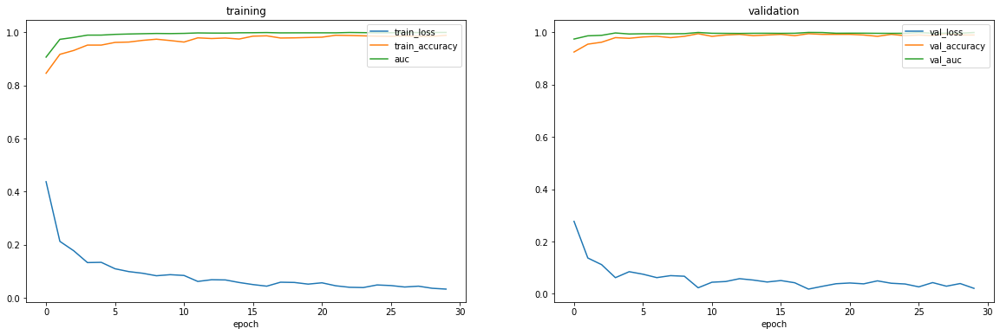
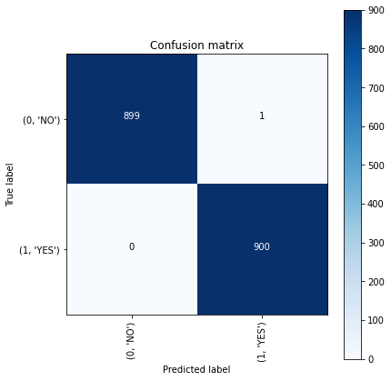
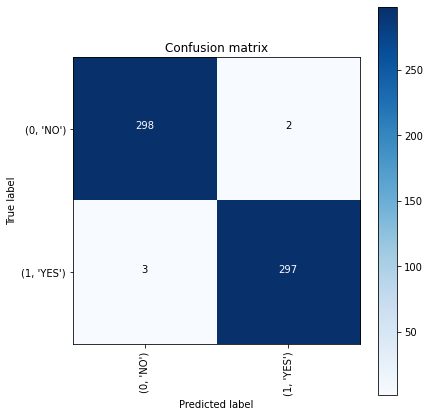
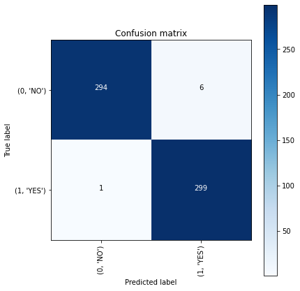
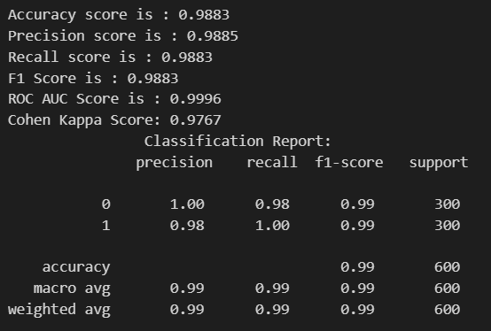

# Brain-Tumor_Detection

# ResNet50 Model
In this project, we use the ResNet50 model for image classification. ResNet50 is a deep convolutional neural network introduced in 2015.

ResNet50 is part of the ResNet architecture, using short-cut connections in convolutional blocks (residual blocks) to build very deep neural networks that are easier to train. ResNet50 has 50 convolutional layers.

Advantages of ResNet50:

- 'Very deep network (50 layers) but still easy to train due to residual connections.
- 'Delivers high performance on many computer vision tasks like image classification, object detection.
- 'Pre-trained weights on large dataset ImageNet make it easy to fine-tune for other tasks.

# Dataset
We have used [Brain Tumor Detection](https://www.kaggle.com/datasets/ahmedhamada0/brain-tumor-detection) dataset which contains MRI images of brain with or without tumor in three folders "no", "pred" and "yes".

The dataset contains 3 folders: 

- `yes`: 1500 Brain MRI Images that are tumorous
- `no`: 1500 Brain MRI Images that are non-tumorous
- `pred`: Folder contains prediction images

So in total there are 3060 Brain MRI images, with equal numbers of tumorous and non-tumorous images.

# Model Training and Evaluation
To train the model, we use 30 epochs with EarlyStopping to stop early if the validation accuracy does not improve after 6 consecutive epochs.

Resulting:

- Evaluation on Training Set:

- Evaluation on Validation Set:

    - This allows us to compare the model's accuracy between the training and validation sets to evaluate overfitting.

- Evaluation on Test Set:

- Evaluation metric results:

